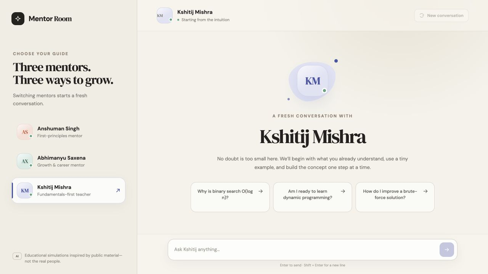

# Mentor Room

A persona-based chatbot inspired by three Scaler educators: Anshuman Singh, Abhimanyu Saxena, and Kshitij Mishra. Each mentor has a separate prompt, their own starter questions, and a fresh conversation state.

> This is a student project based only on public material. The generated replies are not statements from the real people.



## Features

- Three clearly visible personas with distinct teaching styles
- Persona switcher that resets the conversation
- Persona-specific suggestion chips
- Multi-turn Gemini conversations with the correct system prompt
- Animated typing state and friendly API error messages
- Responsive desktop and mobile layouts
- API key kept only on the server
- Input validation and basic automated API tests

## Run locally

You need Node.js 20+ and a Gemini API key.

```bash
git clone https://github.com/nipun172006/PersonaGenAi.git
cd PersonaGenAi
npm install
cp .env.example .env
```

Add your key to `.env`:

```env
GEMINI_API_KEY=your_actual_key
```

Then start both the UI and API:

```bash
npm run dev
```

Open [http://localhost:5173](http://localhost:5173).

## Check the project

```bash
npm run check
```

This runs the Node test suite and creates a production build.

## Deploy on Render

[](https://render.com/deploy?repo=https://github.com/nipun172006/PersonaGenAi)

The repository includes a `render.yaml` Blueprint, so most settings are filled automatically:

1. Click **Deploy to Render** and sign in.
2. Enter your Gemini key when Render asks for `GEMINI_API_KEY`.
3. Keep the free instance and Singapore region selected.
4. Apply the Blueprint and wait for the health check to pass.
5. Open the generated `onrender.com` URL and test one message.

**Live project:** [https://personagenai-hxfa.onrender.com](https://personagenai-hxfa.onrender.com)

Never prefix the key with `VITE_`; that would expose it to the browser bundle.

## Project structure

```text
api/
  _lib/gemini.js       # Validation and Gemini API call
  _lib/personas.js     # Server-side system prompts
  chat.js              # Serverless API handler
src/
  data/personas.js     # Public UI copy and suggestions
  App.jsx              # Chat interface and state
  styles.css           # Responsive visual design
test/chat.test.js      # API unit tests
prompts.md             # Prompt decisions and research notes
reflection.md          # Assignment reflection
render.yaml            # Render deployment settings
server.js              # Local Express server
```

## Prompt and research notes

The complete prompts and the reason behind the main choices are in [prompts.md](prompts.md). I used Scaler’s instructor pages and public posts/interviews from [Anshuman Singh](https://www.linkedin.com/in/anshumansingh26), [Abhimanyu Saxena](https://www.linkedin.com/in/abhimanyusaxena), and [Kshitij Mishra](https://in.linkedin.com/in/kshitij-mishra-a5779334).

The backend uses Google’s stable `gemini-2.5-flash` model by default. It can be changed with `GEMINI_MODEL`.
